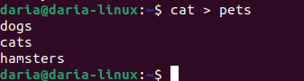
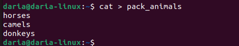
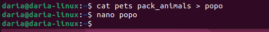
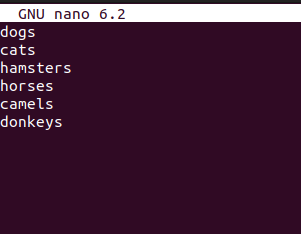
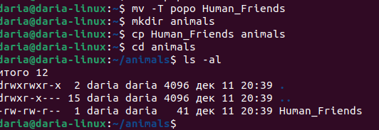
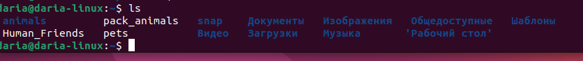

1.  Работа с директориями и файлаи
    cat > pets
    
    cat > pack animals
    
    cat pets pack animals > popo
    
    nano popo
    

    mv -T popo Human Friends

    mkdir animals
    cp Human Friend 
    
    

2.  Установка MySQL
    sudo apt update
    sudo apt install mysql-server-8.0

3. 
    wget https://desktop.docker.com/linux/main/amd64/docker-desktop-4.23.0-amd64.deb
    dpkg -i docker-desktop-4.23.0-amd64.deb
    apt -f install

by Шкатова Дарья Андреевна (№ групы: 4045)

